# Progress - Italian Meals App

**Author:** Francesca Oliverio  
**Repo:** [github.com/francescaoliverio/italian-meals-app-react-native](https://github.com/francescaoliverio/italian-meals-app-react-native)  
**Last Updated:** 2026-07-08

This document tracks the development progress and architectural milestones for the Italian Meals application.

## 📜 Google Doc

Shared Google Doc: ([🔗 link](https://docs.google.com/document/d/1RXdJJVh4GlMYAngYksM9MLcUvdgkYoO3lizdgMCK36Y/))

## 📸 App Screenshots

|                                                              |                                                              |
| ------------------------------------------------------------ | ------------------------------------------------------------ |
| Splash Screen                                                | Login Screen                                                 |
| 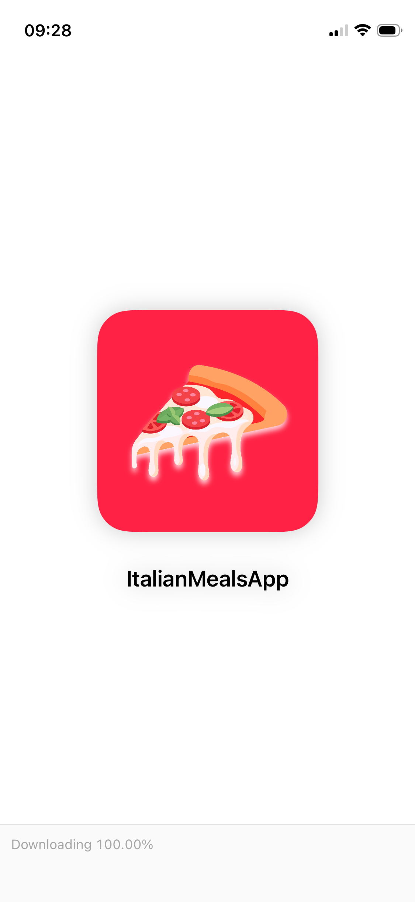                  | 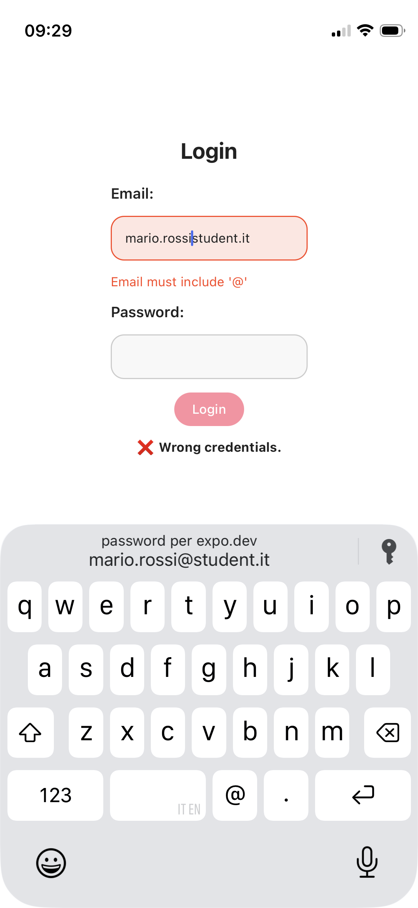                    |
| Settings Screen                                              | Details Screen                                               |
| 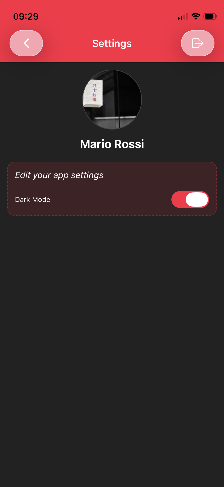              | 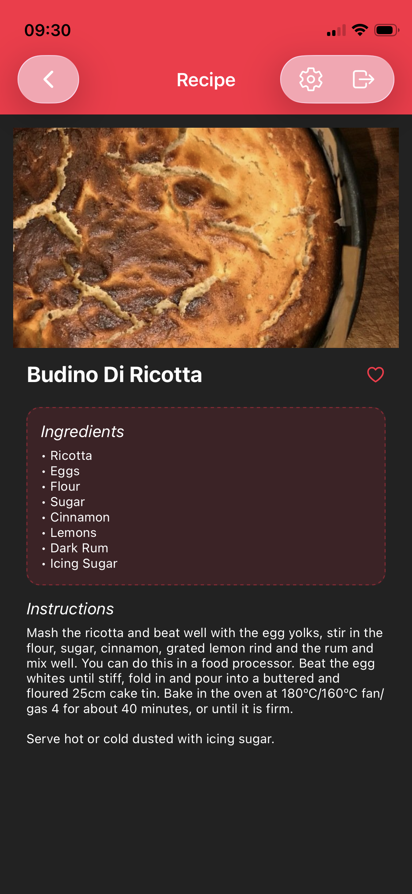                |
| Home Screen                                                  |
| 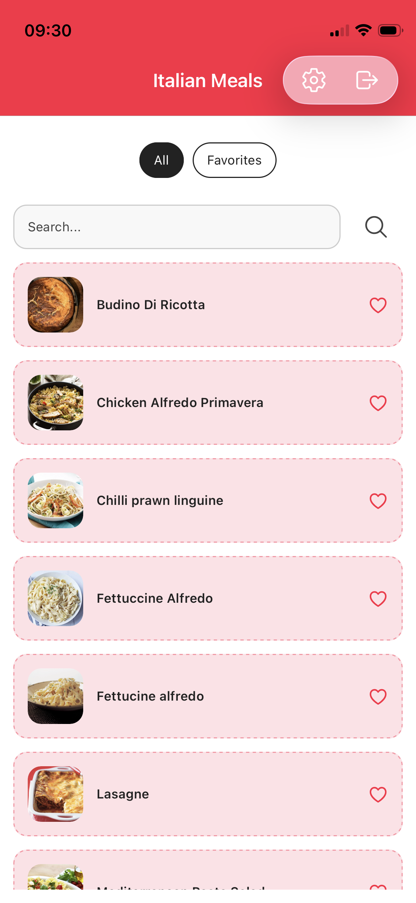                | 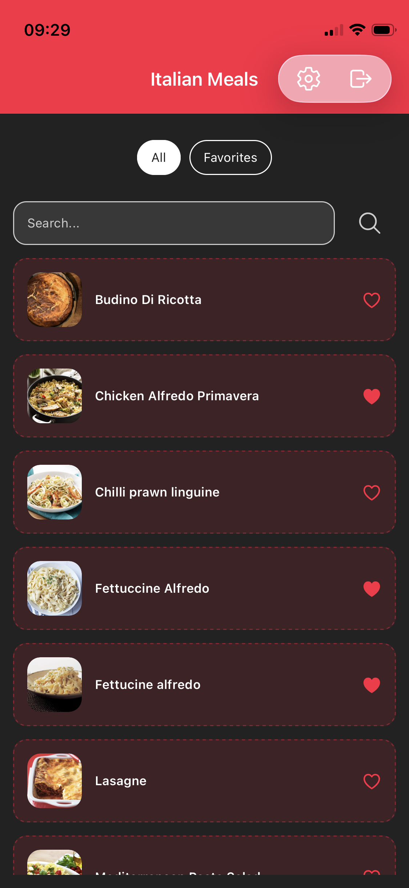                |
| Search Screen                                                |
| 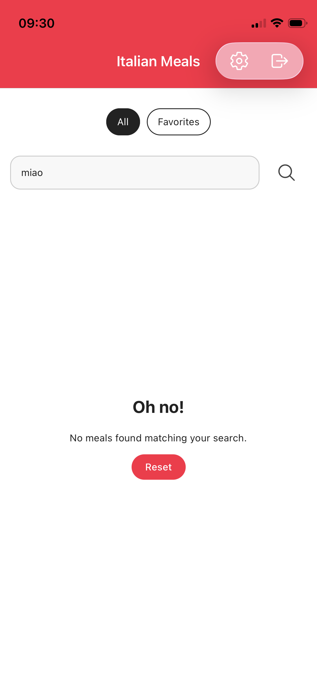            | 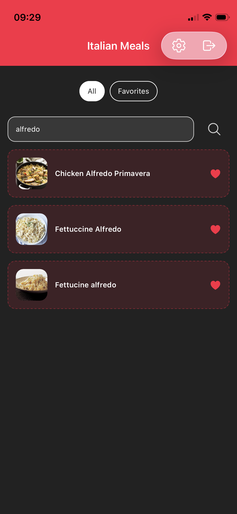            |
| Favorites Screen                                             |
| 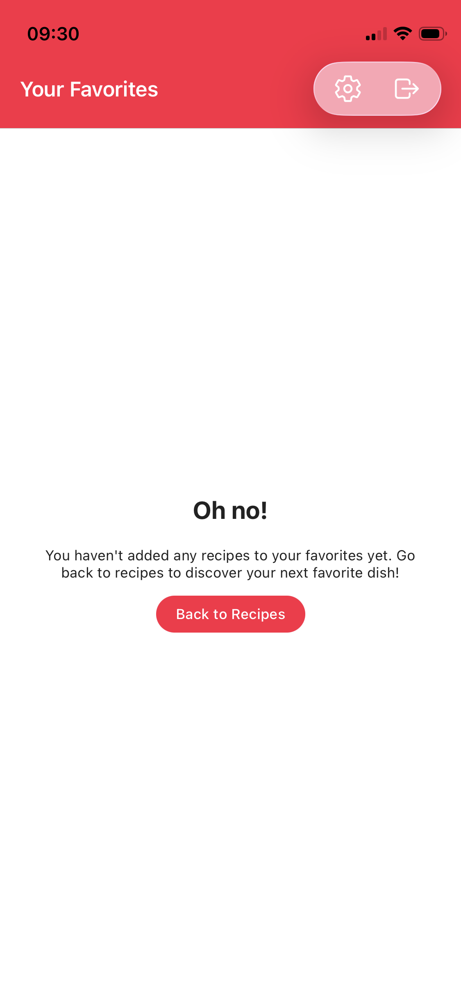      | 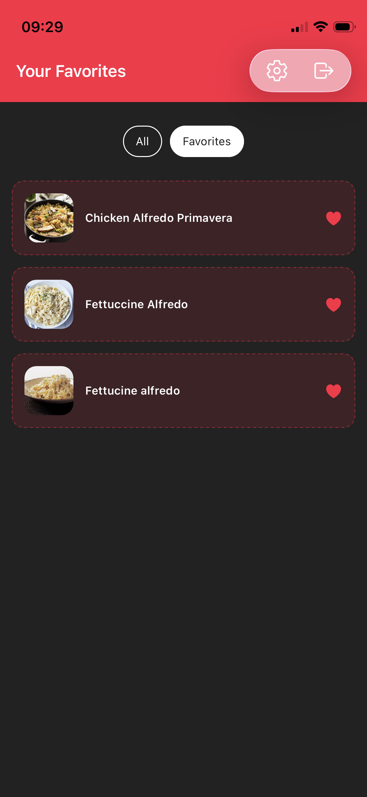      |
| Deep Linking                                                 |
| 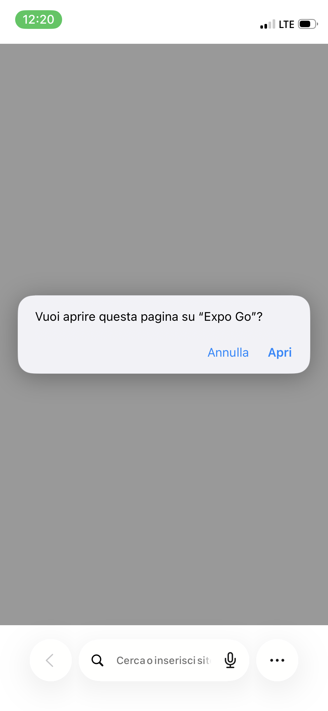 | 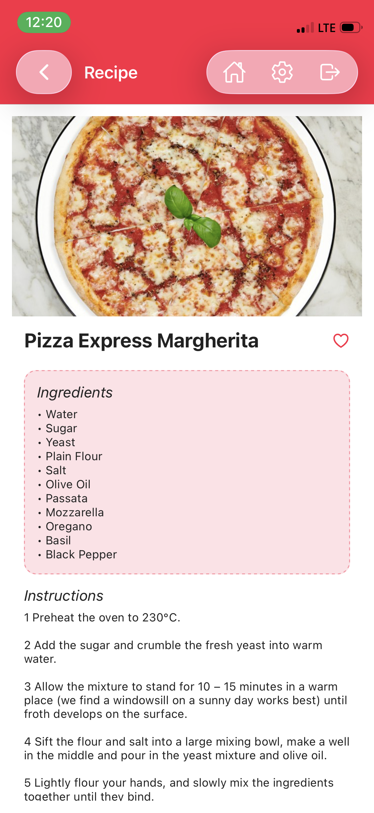 |

---

## 🔐 Mock Users (Login Credentials)

| Email                     | Password    |
| ------------------------- | ----------- |
| mario.rossi@student.it    | React2026!  |
| giulia.bianchi@student.it | Expo2026!   |
| luca.verdi@student.it     | Mobile2026! |

## 📝 Notes

### 💾 Context

- Global Context managed with Context (Auth, Favorites, Theme)

### 👁️‍🗨️ Accessibility

```js
<Pressable onPress={() => toggleFavorite(idMeal)}>
  <Text accessibilityRole="button" accessibilityLabel="Add to favorites">
    {active ? "♥" : "♡"}
  </Text>
</Pressable>
```

### 🔗 Deep Linking

```js
const Stack = createNativeStackNavigator({
  screenOptions: ({ navigation }) => ({
    // [...]
  }),
  screens: {
     Home: {
        if: useIsSignedIn,
      screen: Home,
      linking: { path: "home" },
       // [...]
    },
    Favorites: {
       if: useIsSignedIn,
      screen: Favorites,
      linking: { path: "favorites" },
       // [...]
    },
    Details: {
       if: useIsSignedIn,
      screen: Details,
      linking: { path: "details/:id" },
       // [...]
    },
    Settings: {
       if: useIsSignedIn,
      screen: Settings,
      linking: { path: "settings" },
       // [...]
    },
    Login: {
       if: useIsSignedOut,
      screen: Login,
      linking: { path: "login" },
       // [...]
    }
  }
})

const linking = { prefixes: ["italianmealsapp://", "exp://172.20.10.7:8081/--/"] }

const Navigation = createStaticNavigation(Stack)

export default function App() {
  return (
   {/* ... */}
      <NavigationGuard />
   {/* ... */}
  )
}

function NavigationGuard() {
  const { isLoading } = useAuth()
  if (isLoading) {
    return <LoadingView />
  }
  return <Navigation linking={linking} />
}
```
