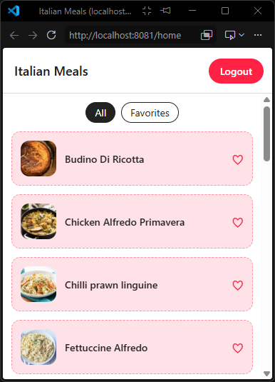
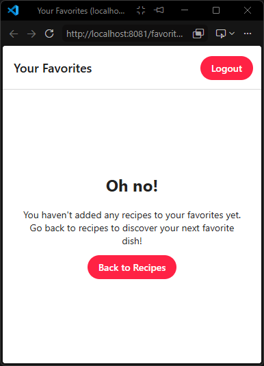
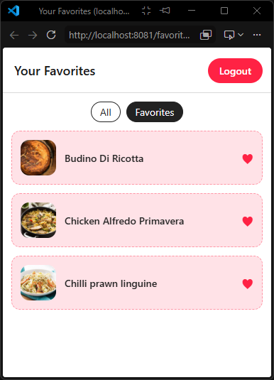
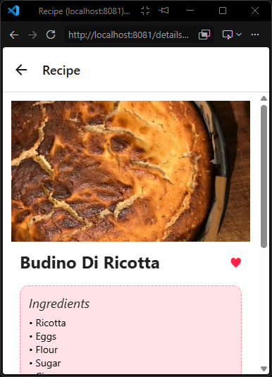
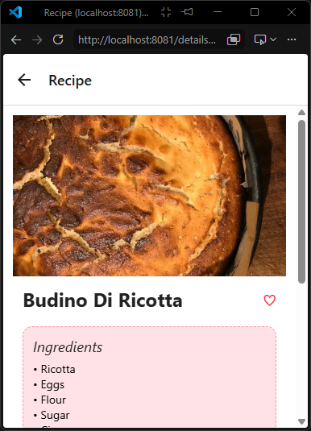
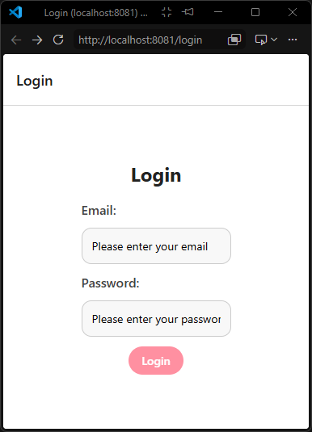
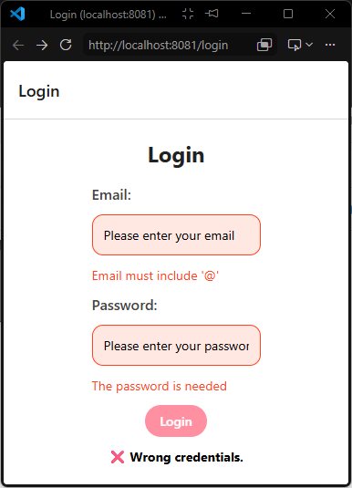
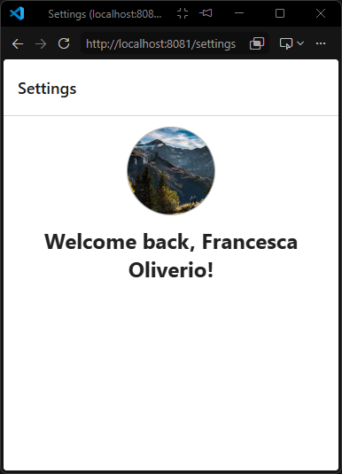

# Project Progress & Roadmap

This document tracks the development progress and architectural milestones for the Italian Meals application.

---

## 🚀 Completed Milestones

### 1. Core Architecture & State
* [x] **Layered Architecture:** Separated UI screens from core logic using dedicated services (`mealsApi.ts`, `storage.ts`).
* [x] **Global Favorites State:** Implemented `FavoritesContext` to synchronize favorited items with persistent local storage.
* [x] **Custom Hooks & Optimization:** Created `useMeals` to manage global data fetching, utilizing `useCallback` to completely eliminate infinite re-render loops.

### 2. Screens & UI System
* [x] **Home Screen:** Integrated a dynamic list displaying available Italian recipes.
* [x] **Details Screen (Base):** Implemented the standard recipe view displaying ingredients and instructions.
* [x] **Favorites Screen:** Added a dedicated view featuring automated data filtering and a custom layout for empty states.
* [x] **Design Tokens & Style Refactor:** Centralized `colors`, `spacing`, and `borderRadius` into a unified layout system, removing all inline styling.
* [x] **Reusable Components:** Created a production-ready `<Button />` with automatic touch-feedback, as well as standalone reusable `MealCard` and status components.

## 📸 App Screenshots

